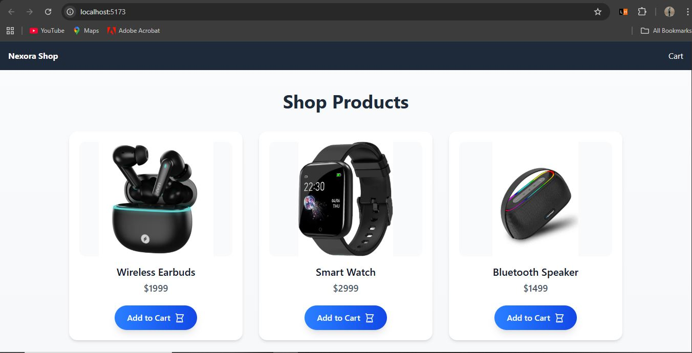
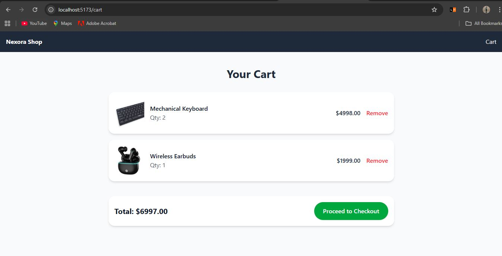
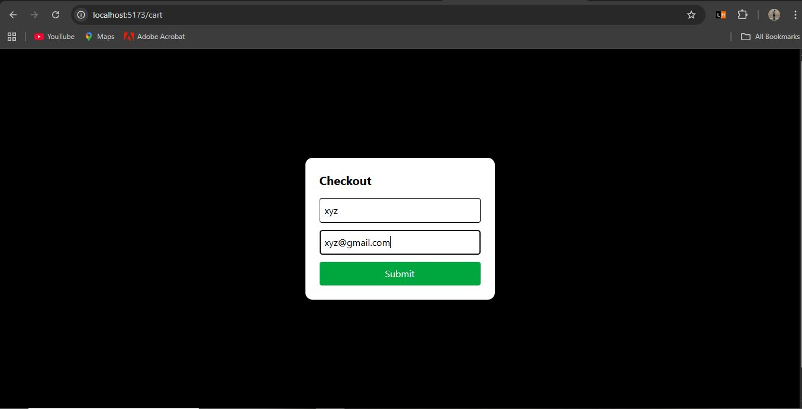
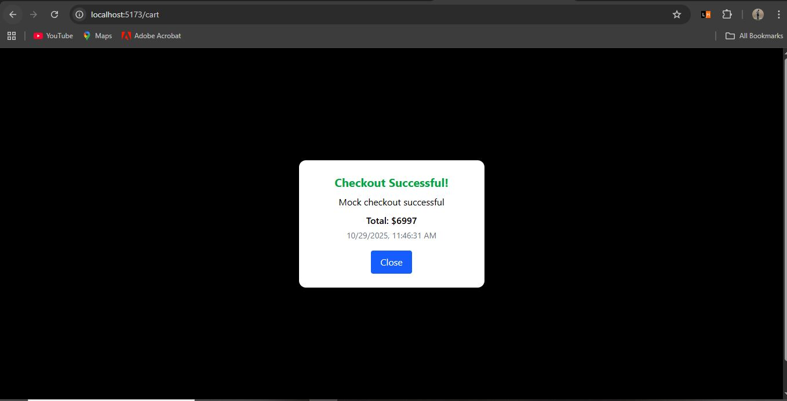

# Nexora Shop 

Hey! This is my Nexora Shop project. It’s a basic e-commerce website where you can see products, add them to the cart, and do a mock checkout. Built with React for frontend and Node.js + Express + MongoDB for backend.

-------------------------------------------------------------------------------------------------------------------------------------------

## Features

* View all products in a neat grid
* Add products to your cart
* See your cart with items, quantity, and total price
* Remove items from cart if you want
* Checkout form with name and email (mock checkout)
* Responsive design — works on desktop and mobile

-------------------------------------------------------------------------------------------------------------------------------------------

## Tech Stack

* Frontend: React, Tailwind CSS, Axios
* Backend: Node.js, Express
* Database: MongoDB (Mongoose)
* Extras: Nodemon for auto-reload

------------------------------------------------------------------------------------------------------------------------------------------------------------------------------------------

## How to Run

### 1. Backend

cd backend
npm install
npm run start

Server will start on `http://localhost:5000`

### 2. Frontend

cd frontend
npm install
npm run dev

Open browser: `http://localhost:5173`

-------------------------------------------------------------------------------------------------------------------------------------------
## Screenshots 

Homepage: 

Cart Page:

Checkout Modal 1: 

Checkout Modal 2:

-------------------------------------------------------------------------------------------------------------------------------------------
## Author 
Rajesh Patil
